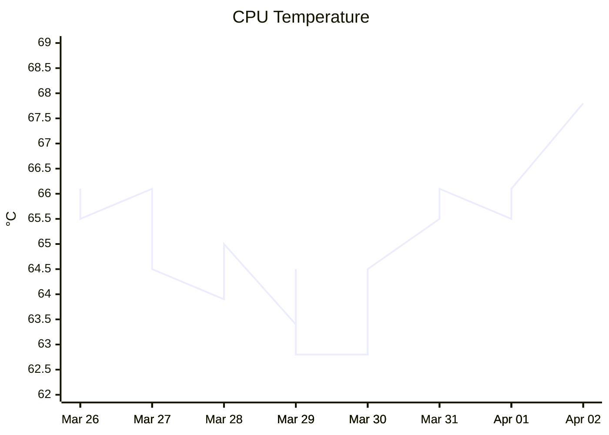
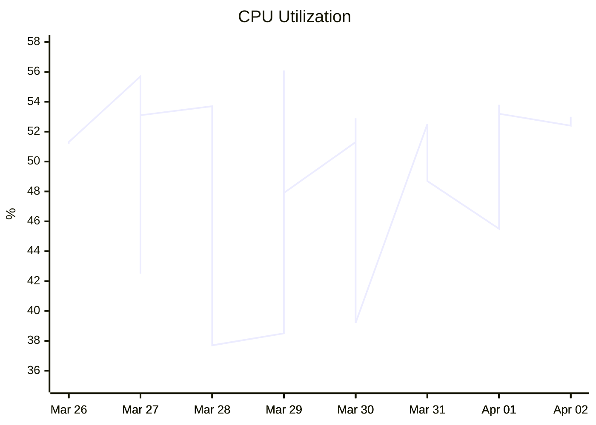
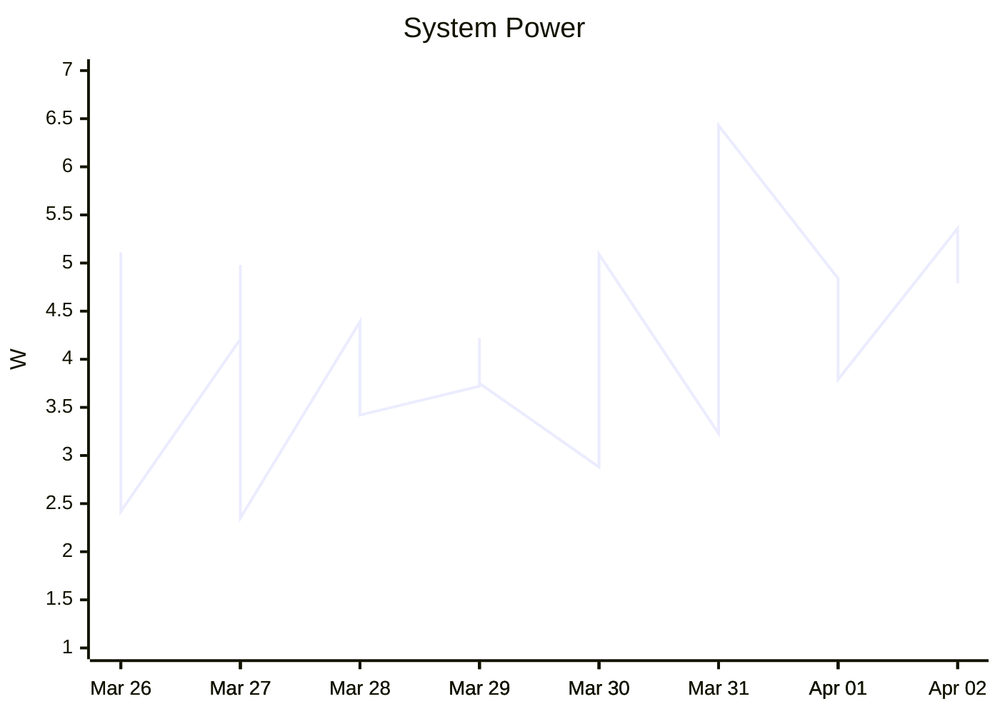
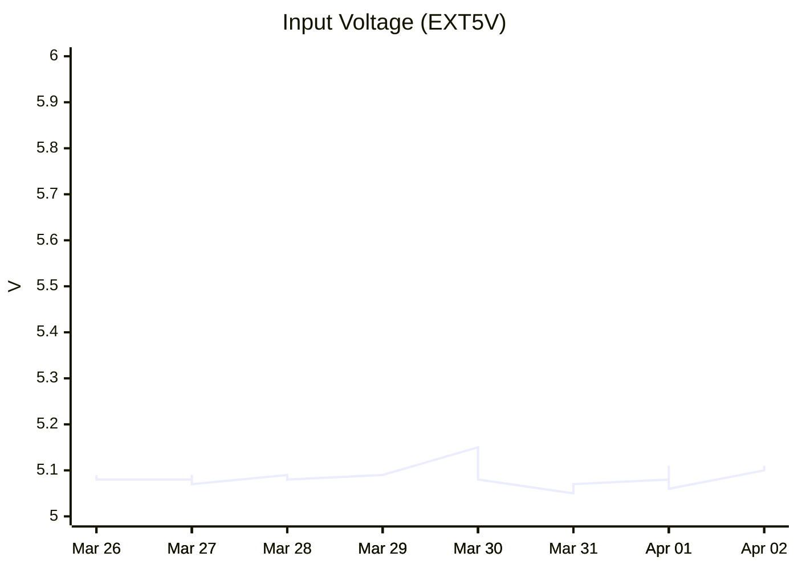

# Night Watcher — Run Reports

Operational health reports generated from Prometheus metrics by
[`scripts/analyze_health.py`](../scripts/analyze_health.py).

To regenerate this file:

```bash
# Default: query raspberrypi.local:9090, last 7 days
uv run scripts/analyze_health.py \
    --prometheus http://<your-pi-hostname>:9090 \
    --days 7

# Shorter window
uv run scripts/analyze_health.py --days 1

# Preview without writing
uv run scripts/analyze_health.py --no-write
```

The script queries Prometheus for all hardware and application metrics,
computes min / avg / max / P95 statistics, flags notable events
(under-voltage, high temperature, CPU spikes), and appends time-series
charts for the key metrics.

---

<!-- HEALTH-REPORT-START -->
<!-- Generated by scripts/analyze_health.py on 2026-04-02 12:23 UTC -->

**Generated:** 2026-04-02 12:23 UTC &nbsp;·&nbsp; **Data window:** 7 days

### Resource Summary

| Metric | Min | Avg | Max | P95 |
| --- | ---: | ---: | ---: | ---: |
| CPU utilization | 34.2 % | 48.7 % | 71.4 % | 55.4 % |
| RAM utilization | 8.4 % | 9.7 % | 10.9 % | 10.4 % |
| Disk utilization | 9.8 % | 11.6 % | 13.6 % | 13.6 % |
| CPU temperature | 61.1 °C | 64.9 °C | 70.5 °C | 68.3 °C |
| Input voltage (EXT5V) | 5.020 V | 5.082 V | 5.146 V | 5.110 V |
| System power | 1.82 W | 4.16 W | 7.54 W | 5.53 W |
| CPU core current | 0.893 A | 2.937 A | 6.564 A | 4.301 A |

### Notable Events

- ✅ **No under-voltage events** — EXT5V stayed above 4.75 V (min: 5.020 V)
- 🟡 **Temperature occasionally warm:** 1 samples ≥ 70°C (max 70.5°C) — monitor if deployed in direct sun
- ✅ **CPU load healthy** — avg 48.7%, rarely exceeds 90% (0.0% of samples)
- ✅ **RAM healthy** — avg 9.7%, peak 10.9%

### Power Consumption

Average system power: **4.2 W** &nbsp;·&nbsp; Peak: **7.5 W** &nbsp;·&nbsp; P95: **5.5 W**

Peak draw (7.5 W) is 28% of the 27 W PSU — comfortable headroom for the recommended Raspberry Pi 27 W USB-C PSU.

CPU core current: avg **2.937 A**, peak **6.564 A**, P95 **4.301 A**

### Thermal Management

Average temperature: **64.9°C** &nbsp;·&nbsp; Peak: **70.5°C** &nbsp;·&nbsp; P95: **68.3°C**

Temperature is within acceptable range. Occasional spikes under YOLO inference load are normal — the heatsink is working.

### Time-Series Charts

*Charts show sampled data over the reporting window.*

#### CPU Temperature



#### CPU Utilization



#### System Power



#### Input Voltage (EXT5V)



<!-- HEALTH-REPORT-END -->
